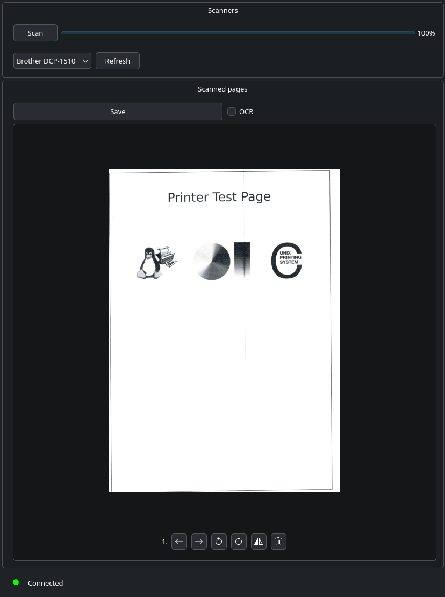

# SANE IN THE MEMBRANE

Project aims to solve a very specific problems for using [SANE](https://www.sane-project.org/)
compatible scanners over the network on clients with different operating systems.
Clients should be able to scan without any drivers only depending on the server
to know how to interact with scanners.

This project creates a server binary that interacts with the scanners
(needs to be installed on a SANE compatible host) and a client application
that can talk to the server over gRPC and can request scans from the server.
Server binary should be run on a linux host with sane backends installed.
Server dynamically links to `libsane` and depends on it.

Client binary is a QT6 application that tries to connect to a server
over gRPC. It can request a list of scanners from the server and initiate
a scan. Currently all data transferred from the server to client is
uncompressed and unencrypted.
Client supports previewing scans and exporting scanned pages into a pdf document.

## Features

### Server

- Uses locally installed and configured SANE scanners
- Provides an easy to use gRPC interface for reading data from a scanner as it scans
- Automatic service publishing over mDNS on local network (requires [avahi](https://avahi.org/)
or similar program for automatic server detection by client)

### Client

- Frontend for accessing scanners
- Displays scanned pages
- Can reorder, rotate and delete pages
- Supports restoring sessions if pdf file was not saved or the program
crashed (restores unsaved pages)
- Automatically tries to connect to an advertised service on the local network
- Can optionally OCR all pages (if it detects that
[OCRmyPDF](https://github.com/ocrmypdf/OCRmyPDF/) is installed on the machine and
the binary is compiled with OCR support)

<div align = center>

</div>

## Server - dependencies

Depends on `gRPC`, `avahi-client` and `sane`.
`avahi-client` and `sane` are always linked dynamically, while `gRPC` is linked
dynamically in debug mode but statically in release.
Make sure to have `avahi-client` and `sane` installed for the server to work.

## Client - dependencies

Depends on `gRPC` and `Qt6`. `gRPC` is linked in the same way as for the server.
`Qt6` should be available as a dynamic library to link against.

## Building

```shell
cmake -B build -S . -GNinja
cmake --build build
```

On linux systems this should build both the server and client binaries,
also builds tests (to skip them set `-DBUILD_TESTS=OFF`).
For windows builds see [windows build actions](.github/workflows)
(includes a fully static build of qt and a dll build).

## TODO

Features, tasks and ideas to do in no particular order:

- [x] Make UI nicer
- [x] Reorder displayed pages
- [x] Rotate pages
- [x] Compress packets
- [x] Automatic server discovery
- [x] Test windows build
- [x] Add OCR support - checks for OCRMyPdf "executable"
- [ ] Add tests
- [x] Decouple pages logic from direct rendering
- [x] Ask to quit only when files are not saved
- [x] Session restoration
- [x] Correctly handle image transformations when saving them to pdf
    - [x] Rotate image
    - [x] Mirror image
- [ ] Document dependencies and build process
- [ ] Manually connect to server
- [ ] Manual server port binding
- [x] Server utils for checking port of running server
